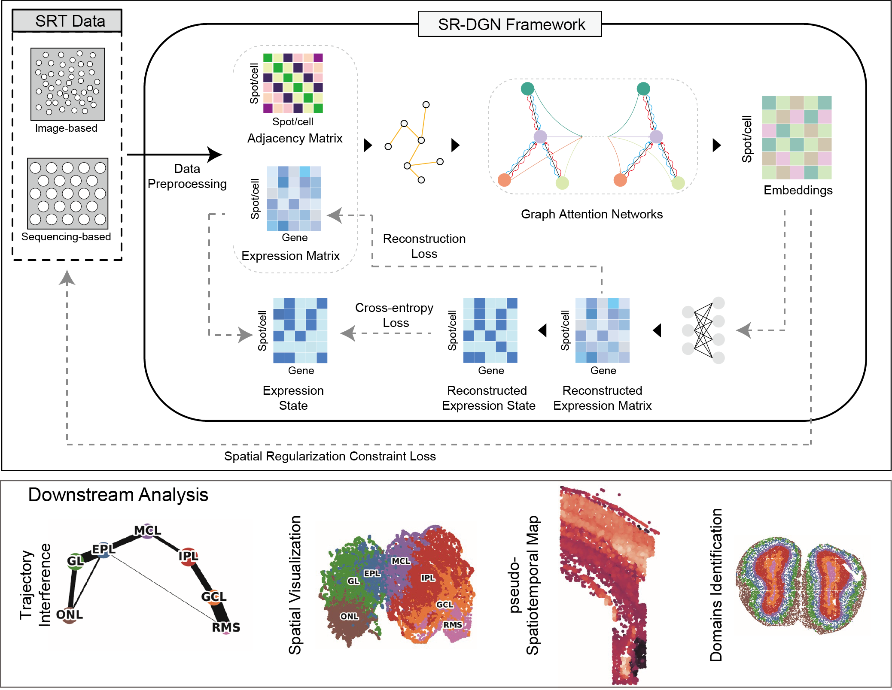

# Deciphering spatial domains from spatially resolved transcriptomics through spatially regularized deep graph networks



## Overview
SR-DGN utilizes graph attention networks (GATs) to adaptively aggregate gene expression in-formation from neighboring spots or cells. We introduced spatial regularization constraints in SR-DGN to ensure the consistency of neighborhood relationships between the original space and embedding space. Additionally, SR-DGN employs cross-entropy (CE) loss to learn gene expression states, mitigating the impact of noisy gene dropouts. We evaluated the performance of SR-DGN across multiple datasets. The results demonstrate that SR-DGN can accurately identify tissue structures in SRT data of varying resolutions. Overall, SR-DGN is a powerful tool for precise spatial domain identification.

## Requirements
You'll need to install the following packages in order to run the codes.
* pandas~=1.3.5
* numpy~=1.21.5
* scanpy~=1.9.3
* matplotlib~=3.5.2
* scikit-learn~=1.0.2
* scipy~=1.7.3
* seaborn~=0.12.0
* torch~=1.11.0
* tqdm~=4.64.1
* R==4.2.1

## Datasets
All datasets used in this paper are available for download from the following websites. 

(1) Stereo-seq mouse olfactory bulb data: https://github.com/JinmiaoChenLab/SEDR_analyses. 

(2) Slide-seqV2 mouse olfactory bulb data: https://singlecell.broadinstitute.org/single_cell/study/SCP815/highly-sensitive-spatial-transcriptomics-at-near-cellular-resolution-with-slide-seqv2#study-summary. 

(3) Slide-seqV2 mouse hippocampus dataset: https://singlecell.broadinstitute.org/single_cell/study/SCP354/slide-seq-study. 

(4) osmFISH mouse somatosensory cortex data: https://linnarssonlab.org/osmFISH/. 

(5) Stereo-seq mouse embryos data: https://db.cngb.org/stomics/mosta/.

(6) MERFISH mouse frontal cortex data: https://cellxgene.cziscience.com/collections/31937775-0602-4e52-a799-b6acdd2bac2e/.


## Tutorial
 Reproduce the result of article.

- olfactory bulb(Stereo-seq):
  ```python  
  python  run_mob.py
  ```

- hippocampus:

  ```python  
  python  run_slide.py
  ```

- embryos:

  ```python  
  python run_embryo.py
  ```

- somatosensory cortex:

  ```python  
  python run_osm.py
  ```

- olfactory bulb(Slide-seqV2):

  ```python  
  python run_mob2.py
  ```

- mouse frontal cortex (MERFISH 3D):

  ```python  
  python run_3D.py
  ```


## Contact
Feel free to submit an issue or contact us at gaorui@sdu.edu.cn for problems about the packages.
